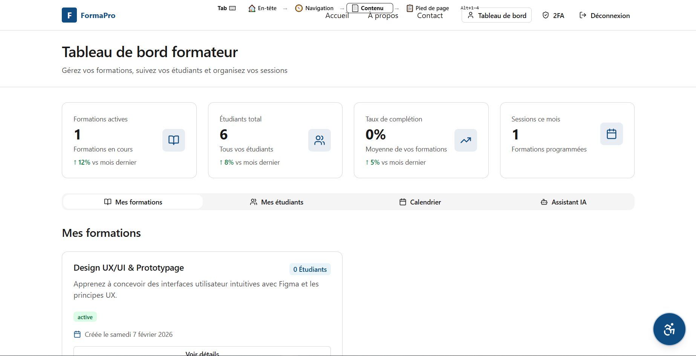
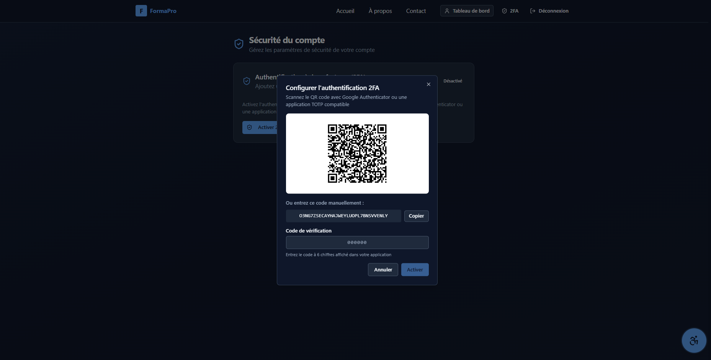
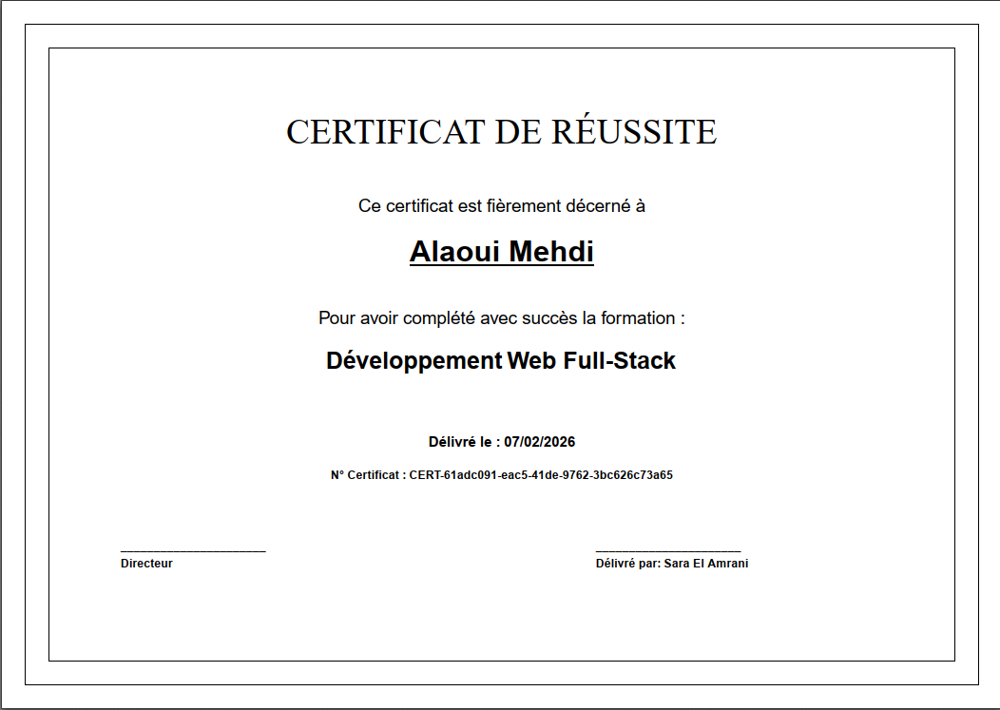

<p align="center">
  
  
  
  
  
  
  
</p>

<h1 align="center">🎓 FormaPro — Plateforme Intelligente de Gestion de Formations</h1>

<p align="center">
  <strong>Une plateforme complète et accessible de gestion de formations professionnelles, propulsée par l'intelligence artificielle et dotée de fonctionnalités d'accessibilité avancées.</strong>
</p>

<p align="center">
  <code>#MaraTechEsprit2026</code>
</p>

---

## 🏆 Équipe — Dev\_Masters

| Membre | Rôle |
|--------|------|
| **Mohamed Aziz Said** | Full-Stack Developer |
| **Mohamed Salim Labbaoui** | Full-Stack Developer |
| **Hamza Dalhoumi** | Full-Stack Developer |

---

## 📋 Table des matières

- [Présentation](#-présentation)
- [Fonctionnalités](#-fonctionnalités)
- [Architecture](#-architecture)
- [Technologies](#-technologies)
- [Installation](#-installation)
- [Variables d'environnement](#-variables-denvironnement)
- [Lancement](#-lancement)
- [API Documentation](#-api-documentation)
- [Structure du projet](#-structure-du-projet)

---

## 🌟 Présentation

**FormaPro** est une plateforme moderne de gestion de formations conçue pour les centres de formation professionnelle. Elle offre une solution complète couvrant l'ensemble du cycle de vie d'une formation — de la planification à la certification — avec un accent particulier sur **l'accessibilité inclusive** et **l'intelligence artificielle**.

La plateforme prend en charge **trois rôles d'utilisateur** :
- **Formateur** — Gère ses formations, niveaux, séances et présences
- **Responsable Formation** — Supervise l'ensemble des formations et des formateurs
- **Administrateur** — Gestion complète des utilisateurs, analyses et journalisation

---

## ✨ Fonctionnalités

### 🔐 Authentification & Sécurité
- Authentification **JWT** avec sessions sécurisées
- Connexion via **Google OAuth 2.0**
- **Authentification à deux facteurs (2FA TOTP)** — Activation, vérification, désactivation avec QR Code
- Réinitialisation de mot de passe par **email avec code de vérification**
- Hashage des mots de passe avec **bcrypt**

### 📚 Gestion des Formations
- CRUD complet pour les **formations**, **niveaux** et **séances**
- Hiérarchie : Formation → Niveaux → Séances
- Statuts de formation : `active` / `inactive`
- **Planificateur automatique** — Vérification toutes les 5 minutes des retards des formateurs avec notifications

### 👨‍🎓 Gestion des Élèves
- CRUD complet avec gestion de profil
- Upload d'avatar via **Cloudinary**
- Statuts : `actif`, `inactif`, `archivé`

### 📝 Inscriptions
- Système d'inscription des élèves aux formations
- Suivi des statuts : `en_cours`, `complétée`, `abandonnée`
- Historique des inscriptions avec dates

### ✅ Suivi de Présence
- Marquage de présence par séance (`présent` / `absent`)
- Détection des conflits (pas de doublons)
- Consultation et mise à jour des présences sur les séances terminées

### 🏅 Certifications & PDF
- Génération automatique de **certificats en PDF** avec PDFKit
- Numéros de certificat uniques (format `CERT-{uuid}`)
- Liaison automatique avec les inscriptions

### 🤖 Chatbot IA — Google Gemini
- Assistant pédagogique propulsé par **Google Gemini 2.5 Flash**
- Prompts contextuels (nom du formateur, formations, rôle)
- Historique des conversations persistant en base de données
- Analyse d'images pédagogiques via Cloudinary

### 📊 Tableau de Bord & Analytiques
- **Statistiques globales** — Formations, élèves, inscriptions, présences, certifications
- **Taux calculés** — Taux de présence, taux de complétion, taux d'abandon
- **Graphiques interactifs** avec Recharts — Répartition par rôle, tendances mensuelles, élèves par formation
- Tableaux de bord adaptés à chaque rôle

### ♿ Accessibilité Avancée
- **Conformité WCAG 2.1 AA** avec audit automatique via `axe-core`
- **Eye Tracking** — Contrôle du curseur par suivi des mouvements de la tête via webcam
- **Eye-Blink Click** — Clic déclenché par clignement d'œil (œil configurable)
- **Assistant vocal** intégré
- **Caméra Face ID** — Reconnaissance faciale avec modèles `face-api.js`
- Panneau d'accessibilité configurable

### 🌍 Internationalisation
- Support multilingue : **Français**, **English**, **العربية**, **Español**

### 📋 Journalisation & Audit
- Intercepteur HTTP global capturant chaque requête
- Logs détaillés : méthode, URL, statut, utilisateur, IP, durée, user-agent
- Classification automatique des actions (READ, CREATE, UPDATE, DELETE, LOGIN, REGISTER)

---

## 🏗 Architecture

```
┌─────────────────────────────────────────┐
│             Frontend (React)            │
│    Vite · TypeScript · Tailwind CSS     │
│    shadcn/ui · Recharts · face-api.js   │
├─────────────────────────────────────────┤
│                REST API                 │
├─────────────────────────────────────────┤
│            Backend (NestJS)             │
│  JWT · Passport · Swagger · Scheduler   │
├─────────────────────────────────────────┤
│              MongoDB                    │
└─────────────────────────────────────────┘
         │              │
    Cloudinary     Google Gemini AI
```

---

## 🛠 Technologies

### Backend

| Technologie | Version | Usage |
|-------------|---------|-------|
| **NestJS** | 10 | Framework backend |
| **MongoDB / Mongoose** | 9.1.6 | Base de données & ODM |
| **@nestjs/jwt** | 11 | Authentification JWT |
| **Passport** | — | Stratégies OAuth & JWT |
| **otplib** | 13.2.1 | TOTP 2FA |
| **qrcode** | 1.5.4 | Génération de QR codes |
| **bcrypt** | 6 | Hashage des mots de passe |
| **PDFKit** | 0.17.2 | Génération de certificats PDF |
| **@google/generative-ai** | 0.24.1 | Chatbot Gemini AI |
| **Cloudinary** | 2.9.0 | Gestion des médias |
| **Nodemailer** | 8.0.1 | Envoi d'emails |
| **@nestjs/swagger** | 7.4.2 | Documentation API |
| **@nestjs/schedule** | 5.0.1 | Tâches planifiées (cron) |
| **TypeScript** | 5.1 | Typage statique |
| **Jest** | 29 | Tests unitaires |

### Frontend

| Technologie | Version | Usage |
|-------------|---------|-------|
| **React** | 18.3.1 | Bibliothèque UI |
| **TypeScript** | — | Typage statique |
| **Vite** | 6.3.5 | Build tool |
| **React Router** | 7.13.0 | Routage SPA |
| **Tailwind CSS** | 4.1.12 | Styles utilitaires |
| **shadcn/ui (Radix UI)** | — | 48 composants UI |
| **Recharts** | 2.15.2 | Graphiques & visualisations |
| **Framer Motion** | 12 | Animations |
| **face-api.js** | 0.22.2 | Reconnaissance faciale & eye tracking |
| **Lucide React** | 0.487.0 | Icônes |
| **MUI** | 7.3.5 | Composants Material UI |
| **Sonner** | 2.0.3 | Notifications toast |
| **react-hook-form** | — | Gestion de formulaires |
| **Axios** | — | Client HTTP |

---

## 🚀 Installation

### Prérequis

- **Node.js** ≥ 18
- **npm** ou **yarn**
- **MongoDB** (local ou Atlas)
- Compte **Cloudinary** (pour les médias)
- Clé API **Google Gemini** (pour le chatbot IA)
- Identifiants **Google OAuth** (pour la connexion Google)

### 1. Cloner le dépôt

```bash
git clone https://github.com/mohamedazizsaid/EspritMaratch2026-devmasters.git
cd formapro
```

### 2. Installation du Backend

```bash
cd hackathonbackend
npm install
```

### 3. Installation du Frontend

```bash
cd hackathonfrontend
npm install
```

---

## 🔑 Variables d'environnement

### Backend (`hackathonbackend/.env`)

```env
# Base de données
MONGO_URI=mongodb://localhost:27017/formapro

# JWT
JWT_SECRET=votre_secret_jwt

# Google OAuth
GOOGLE_CLIENT_ID=votre_google_client_id
GOOGLE_CLIENT_SECRET=votre_google_client_secret
GOOGLE_CALLBACK_URL=http://localhost:3000/api/auth/google/callback

# Cloudinary
CLOUDINARY_CLOUD_NAME=votre_cloud_name
CLOUDINARY_API_KEY=votre_api_key
CLOUDINARY_API_SECRET=votre_api_secret

# Email (Nodemailer)
MAIL_HOST=smtp.gmail.com
MAIL_USER=votre_email@gmail.com
MAIL_PASSWORD=votre_mot_de_passe_app

# Google Gemini AI
GEMINI_API_KEY=votre_clé_api_gemini
```

### Frontend (`hackathonfrontend/.env`)

```env
VITE_API_URL=http://localhost:3000/api
```

---

## ▶️ Lancement

### Démarrer le Backend (port 3000)

```bash
cd hackathonbackend
npm run start:dev
```

### Démarrer le Frontend (port 5173)

```bash
cd hackathonfrontend
npm run dev
```

### Seeder la base de données (optionnel)

```bash
cd hackathonbackend
node seed-database.js
```

---

## 📖 API Documentation

Une fois le backend lancé, la documentation Swagger est accessible à :

```
http://localhost:3000/api/docs
```

### Principaux endpoints

| Module | Endpoints |
|--------|-----------|
| **Auth** | `POST /auth/login` · `POST /auth/register` · `GET /auth/google` |
| **2FA** | `POST /auth/2fa/generate` · `POST /auth/2fa/enable` · `POST /auth/2fa/verify` · `POST /auth/2fa/disable` |
| **Formations** | `GET /formations` · `POST /formations` · `PATCH /formations/:id` · `DELETE /formations/:id` |
| **Élèves** | `GET /eleves` · `POST /eleves` · `PATCH /eleves/:id` · `DELETE /eleves/:id` |
| **Inscriptions** | `GET /inscriptions` · `POST /inscriptions` · `PATCH /inscriptions/:id` |
| **Présences** | `GET /presences` · `POST /presences` · `PATCH /presences/:id` |
| **Certifications** | `GET /certifications` · `POST /certifications` · `GET /certifications/:id/pdf` |
| **Chatbot** | `POST /chatbot` · `GET /chatbot/history` |
| **Analytics** | `GET /analytics` |
| **Logs** | `GET /logs` |

---

## 📁 Structure du projet

```
FormaPro/
├── hackathonbackend/               # API NestJS
│   ├── src/
│   │   ├── auth/                   # Auth, JWT, OAuth, 2FA
│   │   ├── formation/              # Formations, Niveaux, Séances
│   │   ├── eleve/                  # Gestion des élèves + Cloudinary
│   │   ├── inscription/            # Inscriptions aux formations
│   │   ├── presence/               # Suivi de présence
│   │   ├── certification/          # Certificats & génération PDF
│   │   ├── chatbot/                # Chatbot IA (Gemini)
│   │   ├── analytics/              # Tableaux de bord & statistiques
│   │   └── logs/                   # Journalisation & audit
│   └── package.json
│
├── hackathonfrontend/              # SPA React
│   ├── src/
│   │   ├── app/
│   │   │   ├── pages/              # Pages (Home, Login, Dashboards...)
│   │   │   └── components/         # Composants app + 48 primitives UI
│   │   ├── components/             # Accessibilité & Eye Tracking
│   │   ├── services/               # Services API (Axios)
│   │   └── hooks/                  # Hooks personnalisés
│   ├── public/models/              # Modèles face-api.js
│   └── package.json
│
└── README.md
```

---

## 📸 Captures d'écran

### 🖥️ INTERFACE ADMIN
<p align="center">
  
  <br>
  <em>Vue d'ensemble analytique du tableau de bord administrateur</em>
</p>
<p align="center">
  
  <br>
  <em>Gestion des utilisateurs et des rôles</em>
</p>

### 👔 Responsable
<p align="center">
  
  <br>
  <em>Interface du responsable de formation en mode sombre</em>
</p>

### 👨‍🏫 Formateur
<p align="center">
  
  <br>
  <em>Tableau de bord du formateur pour la gestion de ses sessions</em>
</p>

### ♿ Accessibilité & Innovation
<p align="center">
  
  
</p>
<p align="center">
  <em>Contrôle par suivi oculaire et présence par reconnaissance faciale</em>
</p>

### 🔐 Sécurité & Certificats
<p align="center">
  
  
</p>
<p align="center">
  <em>Activation 2FA (TOTP) et génération de certificats PDF</em>
</p>

---

## 📄 Licence

Ce projet a été développé dans le cadre du hackathon **MaraTech Esprit 2026**.

---

<p align="center">
  <strong>Fait avec ❤️ par l'équipe Dev_Masters</strong><br/>
  <code>#MaraTechEsprit2026</code>
</p>
